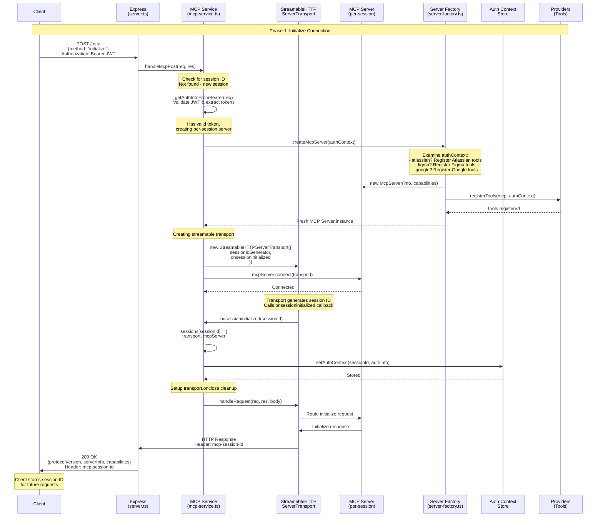
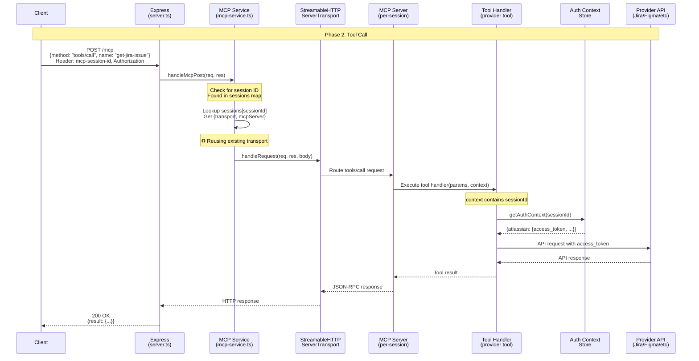
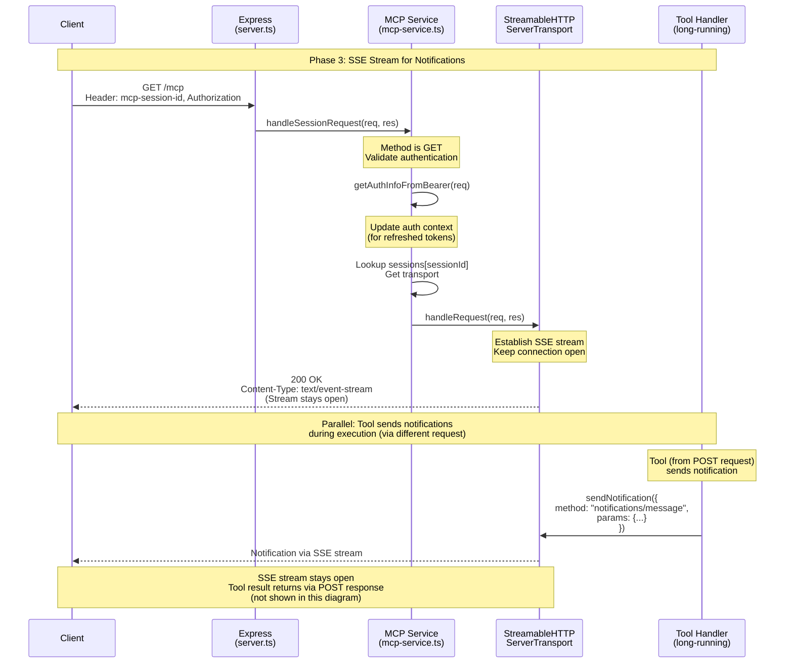
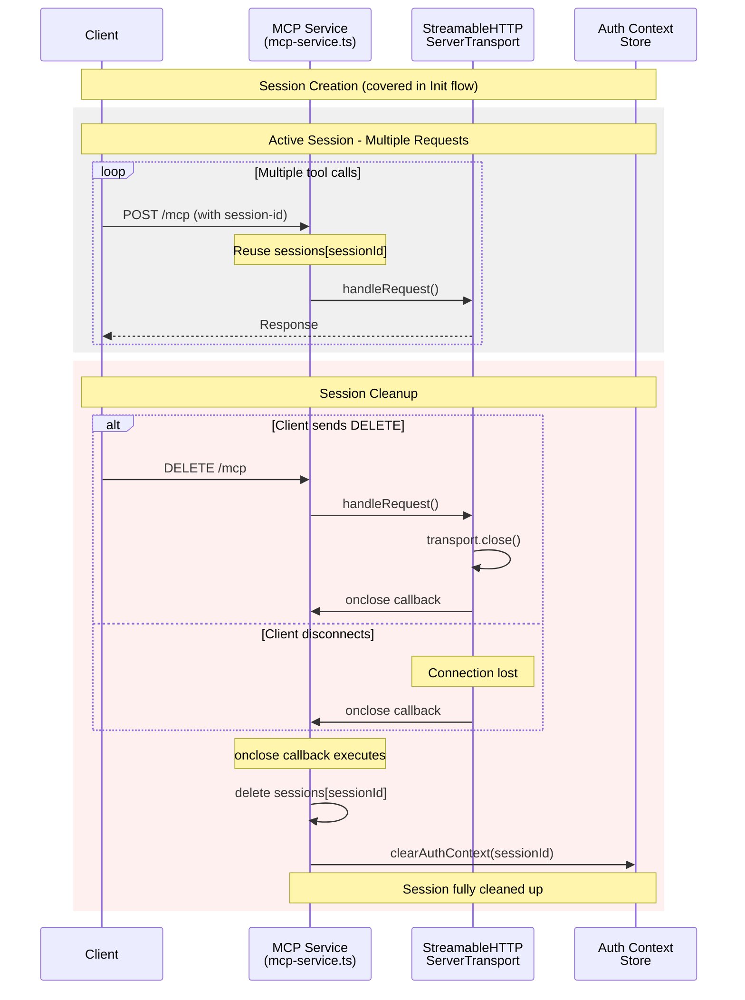

# MCP Flow Diagram

## Initialization Flow



## Tool Call Flow



## SSE Stream & Notifications



## Session Lifecycle



## Key Patterns

### 1. One Session = One Context
```
sessions[sessionId] = {
  transport: StreamableHTTPServerTransport,
  mcpServer: McpServer (with dynamic tools)
}

authContextStore[sessionId] = {
  atlassian: { access_token, ... },
  figma: { access_token, ... },
  google: { access_token, ... }
}
```

### 2. Dynamic Tool Registration
- Each session gets a **fresh MCP Server instance**
- Tools registered based on **authenticated providers** in authContext
- User only sees tools for providers they authenticated with

### 3. Transport Reuse
- Session ID in header → **reuse existing transport**
- No session ID + initialize → **create new session**
- Same transport handles multiple requests

### 4. Notification Routing
- Notifications sent via SSE (GET) stream
- Transport manages routing between POST requests and SSE notifications
