l context description for AI */
  contextDescription?: string;
}
```

### Tool Output

```typescript
/**
 * Output from analyze-figma-scope tool
 */
export interface AnalyzeFigmaScopeOutput {
  /** Markdown scope analysis */
  analysis: string;
  
  /** All generated questions */
  questions: GeneratedQuestion[];
  
  /** Posting results (if posting was attempted) */
  postingResults?: PostCommentResult[];
  
  /** Human-readable posting summary */
  postingSummary?: string;
  
  /** Non-fatal errors encountered */
  errors?: string[];
}

/**
 * A question generated during analysis
 */
export interface GeneratedQuestion {
  /** Question text */
  text: string;
  
  /** Target frame node ID (if frame-specific) */
  frameNodeId?: string;
  
  /** Target frame name */
  frameName?: string;
  
  /** Question category */
  category?: 'interaction' | 'state' | 'edge-case' | 'accessibility' | 'general';
}
```

## Error Types

```typescript
/**
 * Figma API error
 */
export class FigmaApiError extends Error {
  constructor(
    message: string,
    public statusCode: number,
    public fileKey?: string
  );
}

/**
 * Rate limit exceeded after retries
 */
export class RateLimitError extends Error {
  constructor(
    message: string,
    public retryAfter?: number,
    public partialResults?: PostCommentResult[]
  );
}

/**
 * Missing required OAuth scope
 */
export class MissingScopeError extends Error {
  constructor(
    public requiredScope: string,
    public message: string
  );
}
```

## Sequence Diagram: Full Workflow


## Rate Limit Handling Flow

```mermaid
flowchart TD
    Start[questions array] --> Count{Count questions}
    
    Count -->|≤25| Individual[Post individually]
    Count -->|>25| Consolidate[Consolidate per frame]
    
    Individual --> PostLoop[Post each question]
    Consolidate --> ConsolidateLoop[Group by frame]
    ConsolidateLoop --> CountConsolidated{Count consolidated}
    
    CountConsolidated -->|≤25| PostConsolidated[Post consolidated]
    CountConsolidated -->|>25| FailWithQuestions[Return error + all questions]
    
    PostLoop --> CheckRate{Rate limited?}
    PostConsolidated --> CheckRate
    
    CheckRate -->|No| Success[Continue posting]
    CheckRate -->|Yes, retries left| Retry[Wait Retry-After, retry]
    CheckRate -->|Yes, no retries| PartialResult[Return partial + remaining questions]
    
    Retry --> PostLoop
    Success --> Done[All posted]
    
    Done --> Return[Return results]
    PartialResult --> Return
    FailWithQuestions --> Return
```


