# API Signatures: Figma Comments Integration

**Feature Branch**: `001-figma-comments`  
**Date**: January 24, 2026

## Overview

This document summarizes all API signatures for the Figma Comments Integration feature, showing how the layers work together from user-facing interfaces down to the Figma API.

```mermaid
flowchart TB
    subgraph "User Interfaces"
        MCP[MCP Client<br/>VS Code Copilot / Claude Desktop]
        REST[REST API Client<br/>curl / scripts]
    end

    subgraph "Entry Points"
        MCPTool[analyze-figma-scope.ts<br/>MCP Tool Wrapper]
        RESTEndpoint[api/analyze-figma-scope.ts<br/>REST API Wrapper]
    end

    subgraph "Core Logic Layer"
        CoreLogic[core-logic.ts<br/>executeAnalyzeFigmaScope]
    end

    subgraph "Scope Analysis Parser"
        ScopeParser[parse-scope-analysis.ts<br/>parseQuestionsFromScopeAnalysis]
    end

    subgraph "Comment Utilities"
        CommentUtils[figma-comment-utils.ts]
        FetchComments[fetchCommentsForFile]
        PostComments[postQuestionsToFigma]
        AssociateComments[associateCommentsWithFrames]
        FormatComments[formatCommentsForContext]
    end

    subgraph "Figma Provider Layer"
        FigmaClient[FigmaClient<br/>figma-api-client.ts]
        CommentTypes[figma-comment-types.ts<br/>Type Definitions]
    end

    subgraph "External Services"
        FigmaAPI[Figma REST API<br/>api.figma.com]
        LLM[LLM Provider<br/>Anthropic / OpenAI / etc.]
    end

    MCP -->|OAuth Token| MCPTool
    REST -->|PAT Headers| RESTEndpoint
    
    MCPTool -->|AnalyzeFigmaScopeInput| CoreLogic
    RESTEndpoint -->|AnalyzeFigmaScopeInput| CoreLogic
    
    CoreLogic -->|prompt + context| LLM
    LLM -->|markdown analysis| CoreLogic
    CoreLogic -->|markdown| ScopeParser
    ScopeParser -->|ParsedQuestion[]| CoreLogic
    
    CoreLogic --> CommentUtils
    
    CommentUtils --> FetchComments
    CommentUtils --> PostComments
    CommentUtils --> AssociateComments
    CommentUtils --> FormatComments
    
    FetchComments --> FigmaClient
    PostComments --> FigmaClient
    
    FigmaClient -->|GET /files/:key/comments| FigmaAPI
    FigmaClient -->|POST /files/:key/comments| FigmaAPI
    
    CommentTypes -.->|types| CommentUtils
    CommentTypes -.->|types| CoreLogic
```

## Layer 1: Entry Points

### MCP Tool Wrapper

**File**: `server/providers/combined/tools/analyze-figma-scope/analyze-figma-scope.ts`

```typescript
/**
 * Register the analyze-figma-scope MCP tool
 * 
 * @param server - MCP server instance
 * @param deps - Tool dependencies (FigmaClient, LLM client, etc.)
 */
export function registerAnalyzeFigmaScopeTool(
  server: McpServer,
  deps: ToolDependencies
): void;

/**
 * MCP Tool Definition
 */
const toolDefinition = {
  name: "analyze-figma-scope",
  description: "Analyze Figma designs and post questions as comments",
  inputSchema: {
    type: "object",
    required: ["figmaUrls"],
    properties: {
      figmaUrls: { type: "array", items: { type: "string" } },
      contextDescription: { type: "string" }
    }
  }
};

/**
 * Tool handler signature (internal)
 */
async function handleAnalyzeFigmaScope(
  args: AnalyzeFigmaScopeInput,
  context: McpContext
): Promise<McpToolResult>;
```

### REST API Wrapper

**File**: `server/api/analyze-figma-scope.ts`

```typescript
import { Router, Request, Response } from 'express';

/**
 * Register REST API endpoint for analyze-figma-scope
 * 
 * POST /api/analyze-figma-scope
 * 
 * Headers:
 *   X-Figma-Token: string (required)
 *   X-Anthropic-Token: string (required for LLM)
 *   
 * Body: AnalyzeFigmaScopeInput
 * Response: AnalyzeFigmaScopeOutput
 */
export function registerAnalyzeFigmaScopeApi(router: Router): void;

/**
 * Request handler
 */
async function handleAnalyzeFigmaScopeRequest(
  req: Request<{}, AnalyzeFigmaScopeOutput, AnalyzeFigmaScopeInput>,
  res: Response<AnalyzeFigmaScopeOutput | ErrorResponse>
): Promise<void>;
```

## Layer 2: Core Logic

**File**: `server/providers/combined/tools/analyze-figma-scope/core-logic.ts`

```typescript
/**
 * Dependencies required by the core logic
 */
export interface AnalyzeFigmaScopeDeps {
  /** Authenticated Figma API client */
  figmaClient: FigmaClient;
  
  /** LLM client for AI analysis */
  llmClient: LLMClient;
  
  /** Optional progress callback */
  onProgress?: (message: string) => void;
}

/**
 * Execute the analyze-figma-scope workflow
 * 
 * This is the shared business logic used by both MCP and REST interfaces.
 * 
 * @param input - Tool input parameters
 * @param deps - Required dependencies
 * @returns Analysis output with questions and posting results
 * 
 * @throws {InvalidTokenError} If Figma token is invalid or missing scope
 * @throws {FigmaApiError} If Figma API returns an error
 * @throws {LLMError} If LLM inference fails
 */
export async function executeAnalyzeFigmaScope(
  input: AnalyzeFigmaScopeInput,
  deps: AnalyzeFigmaScopeDeps
): Promise<AnalyzeFigmaScopeOutput>;

/**
 * Workflow steps (exported for testing)
 */

/** Step 1: Parse Figma URLs and extract file keys */
export function parseFigmaUrls(
  urls: string[]
): ParsedFigmaUrl[];

/** Step 2: Fetch file metadata and comments for each file */
export async function fetchFileDataWithComments(
  fileKey: string,
  client: FigmaClient
): Promise<FigmaFileWithComments>;

/** Step 3: Analyze screens with AI, generating questions */
export async function analyzeScreensWithComments(
  fileData: FigmaFileWithComments,
  contextDescription: string | undefined,
  llmClient: LLMClient
): Promise<AnalysisResult>;

/** Step 4: Post questions to Figma */
export async function postQuestionsToFigmaFrames(
  questions: GeneratedQuestion[],
  fileKey: string,
  client: FigmaClient
): Promise<PostCommentResult[]>;
```

## Layer 3: Comment Utilities

**File**: `server/providers/combined/tools/analyze-figma-scope/figma-comment-utils.ts`

### Fetching Comments

```typescript
/**
 * Fetch all comments for a Figma file
 * 
 * @param fileKey - Figma file key
 * @param client - Authenticated Figma client
 * @returns Raw comment array from Figma API
 * 
 * @throws {FigmaApiError} On API errors (403, 404, etc.)
 */
export async function fetchCommentsForFile(
  fileKey: string,
  client: FigmaClient
): Promise<FigmaComment[]>;

/**
 * Group comments into threads (parent + replies)
 * 
 * @param comments - Flat array of comments
 * @returns Array of comment threads
 */
export function groupCommentsIntoThreads(
  comments: FigmaComment[]
): CommentThread[];
```

### Associating Comments with Frames

```typescript
/**
 * Associate comment threads with their target frames
 * 
 * @param threads - Comment threads to associate
 * @param frames - Available frames in the file
 * @returns ScreenComments with byFrame map and unassociated list
 */
export function associateCommentsWithFrames(
  threads: CommentThread[],
  frames: FigmaFrame[]
): ScreenComments;

/**
 * Find the nearest frame(s) for a Vector-positioned comment
 * 
 * @param position - Vector position { x, y }
 * @param frames - Available frames
 * @returns Array of frame node IDs (multiple if equidistant)
 */
export function findNearestFrames(
  position: FigmaVector,
  frames: FigmaFrame[]
): string[];

/**
 * Calculate distance from a point to a frame's bounding box
 * 
 * @param point - { x, y } coordinates
 * @param frame - Frame with bounds
 * @returns Distance (0 if inside frame)
 */
export function distanceToFrame(
  point: { x: number; y: number },
  frame: FigmaFrame
): number;
```

### Formatting Comments for AI Context

```typescript
/**
 * Format comments as markdown for inclusion in AI prompts
 * 
 * @param screenComments - Comments organized by frame
 * @param frameId - Specific frame to format (or undefined for all)
 * @returns Markdown string with comment context
 */
export function formatCommentsForContext(
  screenComments: ScreenComments,
  frameId?: string
): string;

/**
 * Format a single thread as markdown
 * 
 * @param thread - Comment thread to format
 * @returns Markdown representation
 */
export function formatThread(
  thread: CommentThread
): string;
```

### Posting Comments

```typescript
/**
 * Post questions as comments to Figma frames
 * 
 * Handles rate limiting:
 * - ≤25 questions: Post individually
 * - >25 questions: Consolidate per frame
 * - Rate limit hit: Retry with backoff, return partial results
 * 
 * @param questions - Questions to post
 * @param fileKey - Target Figma file
 * @param client - Authenticated Figma client
 * @returns Array of posting results (success/failure per question)
 */
export async function postQuestionsToFigma(
  questions: GeneratedQuestion[],
  fileKey: string,
  client: FigmaClient
): Promise<PostCommentResult[]>;

/**
 * Post a single comment to Figma
 * 
 * @param message - Comment message (will be prefixed with "Cascade🤖: ")
 * @param fileKey - Target file
 * @param frameNodeId - Target frame (optional, page-level if omitted)
 * @param client - Authenticated Figma client
 * @returns Figma comment ID on success
 * 
 * @throws {RateLimitError} If rate limit exceeded after retries
 */
export async function postComment(
  message: string,
  fileKey: string,
  frameNodeId: string | undefined,
  client: FigmaClient
): Promise<string>;

/**
 * Consolidate multiple questions into a single bullet-list comment
 * 
 * @param questions - Questions targeting the same frame
 * @returns Consolidated message with header
 */
export function consolidateQuestions(
  questions: GeneratedQuestion[]
): string;
```

### Debug Output

```typescript
/**
 * Write comment data to cache for debugging
 * (Only when SAVE_FIGMA_COMMENTS_TO_CACHE=true)
 * 
 * @param fileKey - Figma file key
 * @param frameId - Frame node ID
 * @param threads - Comment threads for this frame
 */
export async function writeDebugCommentCache(
  fileKey: string,
  frameId: string,
  threads: CommentThread[]
): Promise<void>;
```

## Layer 3.5: Scope Analysis Parser

**File**: `server/providers/combined/tools/analyze-feature-scope/parse-scope-analysis.ts`

This parser lives next to the prompt that defines the format (`prompt-scope-analysis.ts`). 
Both `analyze-figma-scope` and `analyze-feature-scope` can use it.

```typescript
import { parseFigmaUrl, convertNodeIdToApiFormat } from '../../../figma/figma-helpers.js';

/**
 * A question extracted from scope analysis markdown
 */
export interface ParsedQuestion {
  /** The question text (without the ❓ prefix) */
  text: string;
  
  /** Section name where question was found (e.g., "Authentication Flow") */
  sectionName?: string;
  
  /** Figma URLs found in that section */
  figmaUrls: string[];
  
  /** First frame's node ID from the section (API format: "123:456") */
  frameNodeId?: string;
}

/**
 * Parse questions from scope analysis markdown
 * 
 * Extracts all lines starting with "- ❓" and associates them with:
 * - The section heading they appear under (### Section Name)
 * - Figma URLs found in that section [Screen](url)
 * 
 * @param markdown - AI-generated scope analysis markdown
 * @returns Array of parsed questions with section/frame associations
 * 
 * @example
 * ```typescript
 * const markdown = `
 * ### Authentication Flow
 * [Login Screen](https://figma.com/design/ABC?node-id=1-100)
 * 
 * - ✅ Email/password login
 * - ❓ Should "Remember me" persist for 30 days?
 * - ❓ What happens on 5 failed attempts?
 * 
 * ### Remaining Questions
 * - ❓ What browsers must be supported?
 * `;
 * 
 * const questions = parseQuestionsFromScopeAnalysis(markdown);
 * // [
 * //   { text: 'Should "Remember me" persist for 30 days?', 
 * //     sectionName: 'Authentication Flow',
 * //     figmaUrls: ['https://figma.com/design/ABC?node-id=1-100'],
 * //     frameNodeId: '1:100' },
 * //   { text: 'What happens on 5 failed attempts?', ... },
 * //   { text: 'What browsers must be supported?', 
 * //     sectionName: 'Remaining Questions',
 * //     figmaUrls: [],
 * //     frameNodeId: undefined }
 * // ]
 * ```
 */
export function parseQuestionsFromScopeAnalysis(
  markdown: string
): ParsedQuestion[] {
  const questions: ParsedQuestion[] = [];
  let currentSection: string | undefined;
  let currentUrls: string[] = [];
  
  const lines = markdown.split('\n');
  
  for (const line of lines) {
    // Track section headers: "### Feature Area Name"
    const sectionMatch = line.match(/^###\s+(.+)/);
    if (sectionMatch) {
      currentSection = sectionMatch[1].trim();
      currentUrls = [];  // Reset URLs for new section
      continue;
    }
    
    // Extract Figma URLs: [Screen Name](https://...figma...)
    const urlMatches = line.matchAll(/\[([^\]]+)\]\((https:\/\/[^\)]*figma[^\)]+)\)/g);
    for (const match of urlMatches) {
      currentUrls.push(match[2]);
    }
    
    // Extract questions: "- ❓ Question text"
    const questionMatch = line.match(/^-\s*❓\s*(.+)/);
    if (questionMatch) {
      // Parse first URL to get frame node ID
      let frameNodeId: string | undefined;
      if (currentUrls.length > 0) {
        const urlInfo = parseFigmaUrl(currentUrls[0]);
        if (urlInfo?.nodeId) {
          frameNodeId = convertNodeIdToApiFormat(urlInfo.nodeId);
        }
      }
      
      questions.push({
        text: questionMatch[1].trim(),
        sectionName: currentSection,
        figmaUrls: [...currentUrls],
        frameNodeId
      });
    }
  }
  
  return questions;
}

/**
 * Convert parsed questions to GeneratedQuestion format for posting
 * 
 * @param parsed - Questions from parseQuestionsFromScopeAnalysis
 * @returns Questions ready for postQuestionsToFigma
 */
export function toGeneratedQuestions(
  parsed: ParsedQuestion[]
): GeneratedQuestion[] {
  return parsed
    .filter(q => q.sectionName !== 'Remaining Questions')  // Skip general questions
    .map(q => ({
      text: q.text,
      frameNodeId: q.frameNodeId,
      frameName: q.sectionName,
      category: 'general' as const
    }));
}
```

## Layer 4: Figma Provider

### FigmaClient Extensions

**File**: `server/providers/figma/figma-api-client.ts`

```typescript
export interface FigmaClient {
  /** Existing: Make authenticated fetch request */
  fetch(url: string, options?: RequestInit): Promise<Response>;
  
  /** Existing: Get base API URL */
  getBaseUrl(): string;
  
  // NEW METHODS FOR COMMENTS
  
  /**
   * Get all comments for a file
   * GET /v1/files/:file_key/comments
   * 
   * @param fileKey - Figma file key
   * @returns Array of comments
   */
  getComments(fileKey: string): Promise<FigmaComment[]>;
  
  /**
   * Post a new comment to a file
   * POST /v1/files/:file_key/comments
   * 
   * @param fileKey - Target file
   * @param request - Comment message and optional position
   * @returns Created comment with ID
   */
  postComment(
    fileKey: string,
    request: PostCommentRequest
  ): Promise<FigmaComment>;
}

/**
 * Create a Figma client with comment methods
 */
export function createFigmaClient(accessToken: string): FigmaClient;
```

### Type Definitions

**File**: `server/providers/figma/figma-comment-types.ts`

```typescript
// Re-exports from data-model.md

export interface FigmaComment { /* ... */ }
export type FigmaCommentPosition = FigmaFrameOffset | FigmaVector;
export interface FigmaFrameOffset { /* ... */ }
export interface FigmaVector { /* ... */ }
export interface CommentThread { /* ... */ }
export interface ScreenComments { /* ... */ }
export interface PostCommentRequest { /* ... */ }
export interface PostCommentResult { /* ... */ }

// Type guards
export function isFrameOffset(pos: FigmaCommentPosition | undefined): pos is FigmaFrameOffset;
export function isVector(pos: FigmaCommentPosition | undefined): pos is FigmaVector;
```

## Layer 5: Integration Points

### analyze-feature-scope Integration

**File**: `server/providers/combined/tools/analyze-feature-scope/core-logic.ts`

```typescript
/**
 * MODIFIED: Add comment context to scope analysis
 * 
 * @param epicData - Jira epic with Figma links
 * @param deps - Dependencies including Figma client
 * @returns Scope analysis with comment-informed insights
 */
export async function executeAnalyzeFeatureScope(
  input: AnalyzeFeatureScopeInput,
  deps: AnalyzeFeatureScopeDeps
): Promise<AnalyzeFeatureScopeOutput>;

/**
 * NEW: Fetch and format comment context for a Figma file
 */
async function getCommentContextForFile(
  fileKey: string,
  frames: FigmaFrame[],
  client: FigmaClient
): Promise<string>;
```

### write-shell-stories Integration

**File**: `server/providers/combined/tools/writing-shell-stories/core-logic.ts`

```typescript
/**
 * MODIFIED: Include comment context in screen analysis
 * 
 * @param epicData - Jira epic with Figma links
 * @param deps - Dependencies
 * @returns Shell stories incorporating comment insights
 */
export async function executeWriteShellStories(
  input: WriteShellStoriesInput,
  deps: WriteShellStoriesDeps
): Promise<WriteShellStoriesOutput>;

/**
 * NEW: Enhance screen analysis prompt with comment context
 */
function buildScreenAnalysisPrompt(
  screen: FigmaScreen,
  commentContext: string
): string;
```

## Input/Output Types

### Tool Input

```typescript
/**
 * Input for analyze-figma-scope tool
 */
export interface AnalyzeFigmaScopeInput {
  /** Figma URLs to analyze (required, at least one) */
  figmaUrls: string[];
  
  /** Optional context description for AI */
  contextDescription?: string;
}
```

### Tool Output

```typescript
/**
 * Output from analyze-figma-scope tool
 */
export interface AnalyzeFigmaScopeOutput {
  /** Markdown scope analysis */
  analysis: string;
  
  /** All generated questions */
  questions: GeneratedQuestion[];
  
  /** Posting results (if posting was attempted) */
  postingResults?: PostCommentResult[];
  
  /** Human-readable posting summary */
  postingSummary?: string;
  
  /** Non-fatal errors encountered */
  errors?: string[];
}

/**
 * A question generated during analysis
 */
export interface GeneratedQuestion {
  /** Question text */
  text: string;
  
  /** Target frame node ID (if frame-specific) */
  frameNodeId?: string;
  
  /** Target frame name */
  frameName?: string;
  
  /** Question category */
  category?: 'interaction' | 'state' | 'edge-case' | 'accessibility' | 'general';
}
```

## Error Types

```typescript
/**
 * Figma API error
 */
export class FigmaApiError extends Error {
  constructor(
    message: string,
    public statusCode: number,
    public fileKey?: string
  );
}

/**
 * Rate limit exceeded after retries
 */
export class RateLimitError extends Error {
  constructor(
    message: string,
    public retryAfter?: number,
    public partialResults?: PostCommentResult[]
  );
}

/**
 * Missing required OAuth scope
 */
export class MissingScopeError extends Error {
  constructor(
    public requiredScope: string,
    public message: string
  );
}
```

## Sequence Diagram: Full Workflow


## Rate Limit Handling Flow

```mermaid
flowchart TD
    Start[questions array] --> Count{Count questions}
    
    Count -->|≤25| Individual[Post individually]
    Count -->|>25| Consolidate[Consolidate per frame]
    
    Individual --> PostLoop[Post each question]
    Consolidate --> ConsolidateLoop[Group by frame]
    ConsolidateLoop --> CountConsolidated{Count consolidated}
    
    CountConsolidated -->|≤25| PostConsolidated[Post consolidated]
    CountConsolidated -->|>25| FailWithQuestions[Return error + all questions]
    
    PostLoop --> CheckRate{Rate limited?}
    PostConsolidated --> CheckRate
    
    CheckRate -->|No| Success[Continue posting]
    CheckRate -->|Yes, retries left| Retry[Wait Retry-After, retry]
    CheckRate -->|Yes, no retries| PartialResult[Return partial + remaining questions]
    
    Retry --> PostLoop
    Success --> Done[All posted]
    
    Done --> Return[Return results]
    PartialResult --> Return
    FailWithQuestions --> Return
```


