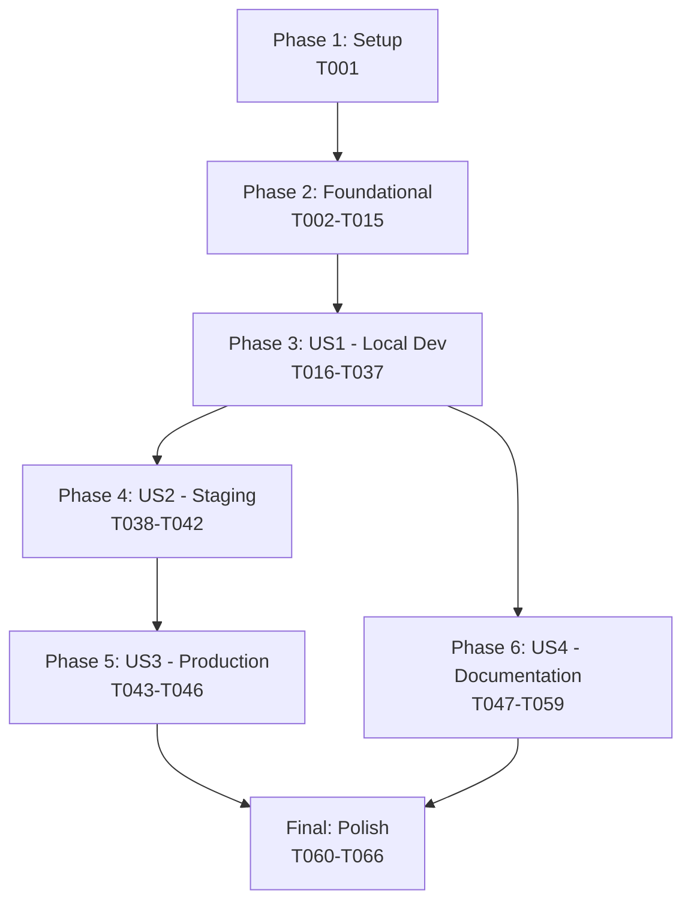

# Tasks: Static Pre-Generated Encryption Keys

**Input**: Design documents from `/specs/001-static-encryption-keys/`  
**Prerequisites**: plan.md ✅, spec.md ✅, research.md ✅, data-model.md ✅, contracts/ ✅, quickstart.md ✅  
**Constitution Compliance**: All tasks align with four core principles (Code Quality First, TDD, UX Consistency, Performance & Reliability)

**Feature Summary**: Replace dynamic RSA key generation with static pre-generated keys loaded from environment variables. Keys are base64-encoded for multi-line PEM format. System gracefully handles missing keys by disabling Google-specific features without breaking core functionality.

## Format: `- [ ] [ID] [P?] [Story] Description`

- **[P]**: Can run in parallel (different files, no dependencies)
- **[Story]**: User story (US1=P1 Local Dev, US2=P2 Staging, US3=P3 Production, US4=P4 Documentation)
- Exact file paths included in all descriptions

## Phase 1: Setup (Shared Infrastructure)

**Purpose**: Create key generation script and update environment configuration

### Tasks

- [X] T001 Create key generation script in `scripts/generate-rsa-keys.sh` with OpenSSL commands for RSA-4096 key pair generation, automatic file permissions (0600 for private key), and base64-encoded output for `.env` file

## Phase 2: Foundational (Blocking Prerequisites)

**Purpose**: Core code changes that all user stories depend on

### Tasks

- [X] T002 [P] Define TypeScript interfaces in `server/utils/key-manager.ts`: `EncryptionState`, `EncryptionDisabledState`, `EncryptionEnabledState`, `IGoogleKeyManager` per contracts/key-manager-interface.md
- [X] T003 [P] Define error classes in `server/utils/key-manager.ts`: `EncryptionNotEnabledError` and `InvalidKeyFormatError` with clear error messages and actionable guidance
- [X] T004 Remove `generateRSAKeyPair()` function from `server/utils/crypto.ts` (no longer needed for dynamic key generation)
- [X] T005 Refactor `GoogleKeyManager` class in `server/utils/key-manager.ts` to remove filesystem operations: delete `getPublicKeyPath()`, `getPrivateKeyPath()`, `keysExist()`, `loadKeysFromDisk()`, `saveKeysToDisk()` methods
- [X] T006 Implement `loadKeyFromEnv()` helper function in `server/utils/key-manager.ts` to decode base64-encoded PEM from environment variable with validation
- [X] T007 Implement `validatePemKey()` helper function in `server/utils/key-manager.ts` using Node.js `crypto.createPublicKey()` and `createPrivateKey()` for format validation
- [X] T008 Implement `areKeysConfigured()` helper function in `server/utils/key-manager.ts` to check if both `GOOGLE_RSA_PUBLIC_KEY` and `GOOGLE_RSA_PRIVATE_KEY` environment variables are set
- [X] T009 Implement `GoogleKeyManager.initialize()` method in `server/utils/key-manager.ts` to load keys from environment, validate PEM format, and set encryption state (enabled/disabled)
- [X] T010 Implement `GoogleKeyManager.isEnabled()` method in `server/utils/key-manager.ts` to return boolean based on current encryption state
- [X] T011 Implement `GoogleKeyManager.getState()` method in `server/utils/key-manager.ts` to return current `EncryptionState` for logging and debugging
- [X] T012 Update `GoogleKeyManager.encrypt()` method in `server/utils/key-manager.ts` to check `isEnabled()` and throw `EncryptionNotEnabledError` if disabled
- [X] T013 Update `GoogleKeyManager.decrypt()` method in `server/utils/key-manager.ts` to check `isEnabled()` and throw `EncryptionNotEnabledError` if disabled
- [X] T014 Update server initialization in `server/server.ts` to call `googleKeyManager.initialize()` during startup with try-catch for `InvalidKeyFormatError`
- [X] T015 Add logging in `server/server.ts` to show encryption status: "✅ Google encryption enabled" or "ℹ️  Google encryption keys not configured - Google Drive/Docs features unavailable"

## Phase 3: User Story 1 - Configure Local Development Encryption (P1)

**Story Goal**: Developer can set up encryption keys locally using script and `.env` file  
**Independent Test**: Run script → Add keys to `.env` → Start server → Verify encryption page works  
**Depends On**: Phase 2 (T002-T015) must be complete

### Implementation Tasks

- [X] T016 [US1] Test key generation script: Run `./scripts/generate-rsa-keys.sh` and verify `private.pem` (0600) and `public.pem` (0644) are created with valid PEM format
- [X] T017 [US1] Test base64 encoding: Verify script outputs base64-encoded keys with no line breaks suitable for environment variables
- [X] T018 [US1] Update `.env.example` with `GOOGLE_RSA_PUBLIC_KEY` and `GOOGLE_RSA_PRIVATE_KEY` entries with explanatory comments
- [X] T019 [US1] Test environment loading: Add base64-encoded keys to local `.env`, start server, verify logs show "✅ Google encryption enabled"
- [X] T020 [US1] Test graceful degradation: Start server without keys in `.env`, verify logs show informational message (not error) and server starts successfully
- [X] T021 [US1] Update `handleEncryptionRequest()` in `server/google-service-encrypt.ts` to check `googleKeyManager.isEnabled()` and return helpful error if disabled
- [X] T022 [US1] Test encryption web page: Access `/google-service-encrypt`, paste service account JSON, verify encrypted output starts with `RSA-ENCRYPTED:`
- [X] T023 [US1] Test decryption: Add encrypted credential to `.env` as `GOOGLE_SERVICE_ACCOUNT_ENCRYPTED`, verify Google tools can decrypt and use it
- [X] T024 [US1] Test invalid base64: Set `GOOGLE_RSA_PUBLIC_KEY` to invalid base64, verify server startup fails with clear error message
- [X] T025 [US1] Test invalid PEM: Set `GOOGLE_RSA_PUBLIC_KEY` to valid base64 but wrong PEM format, verify server startup fails with guidance to regenerate keys
- [X] T026 [US1] Test partial configuration: Set only `GOOGLE_RSA_PUBLIC_KEY` (not private), verify server startup fails with error explaining both keys required

### Test Tasks (Unit & Integration)

- [X] T027 [P] [US1] Unit test: `loadKeyFromEnv()` with missing environment variable throws `InvalidKeyFormatError`
- [X] T028 [P] [US1] Unit test: `loadKeyFromEnv()` with invalid base64 throws `InvalidKeyFormatError` with actionable message
- [X] T029 [P] [US1] Unit test: `validatePemKey()` with valid PEM public key succeeds without error
- [X] T030 [P] [US1] Unit test: `validatePemKey()` with invalid PEM format throws `InvalidKeyFormatError`
- [X] T031 [P] [US1] Unit test: `areKeysConfigured()` returns true when both env vars set, false when either missing
- [X] T032 [P] [US1] Unit test: `GoogleKeyManager.initialize()` with valid keys sets state to enabled
- [X] T033 [P] [US1] Unit test: `GoogleKeyManager.initialize()` without keys sets state to disabled with reason 'keys-not-configured'
- [X] T034 [P] [US1] Unit test: `GoogleKeyManager.encrypt()` when disabled throws `EncryptionNotEnabledError`
- [X] T035 [P] [US1] Unit test: `GoogleKeyManager.decrypt()` when disabled throws `EncryptionNotEnabledError`
- [X] T036 [US1] Integration test: Full encryption/decryption cycle with keys from environment variables produces identical result to original implementation
- [X] T037 [US1] Integration test: Backward compatibility - decrypt existing `RSA-ENCRYPTED:` credentials using new environment-based key manager

## Phase 4: User Story 2 - Deploy to Staging with GitHub Secrets (P2)

**Story Goal**: DevOps engineer can deploy to staging with separate keys from GitHub Secrets  
**Independent Test**: Add staging keys to GitHub Secrets → Deploy via GitHub Actions → Verify staging uses separate keys  
**Depends On**: US1 (T016-T037) must be validated in local dev

### Implementation Tasks

- [ ] T038 [P] [US2] Create `.github/workflows/deploy-staging.yml.example` showing how to inject `STAGING_GOOGLE_RSA_PUBLIC_KEY` and `STAGING_GOOGLE_RSA_PRIVATE_KEY` from GitHub Secrets into environment variables
- [ ] T039 [P] [US2] Document GitHub Secrets naming convention in `docs/deployment.md`: staging uses `STAGING_*` prefix, production uses `PROD_*` prefix
- [ ] T040 [US2] Test staging deployment: Generate separate keys, add to GitHub Secrets with `STAGING_` prefix, deploy, verify staging logs show "✅ Google encryption enabled"
- [ ] T041 [US2] Test key isolation: Verify staging encrypted credentials cannot be decrypted in local dev (different keys), confirm cross-environment isolation
- [ ] T042 [US2] Test staging encryption operations: Use staging deployment to encrypt service account, verify encrypted output works only in staging environment

## Phase 5: User Story 3 - Deploy to Production with GitHub Secrets (P3)

**Story Goal**: DevOps engineer can deploy to production with separate keys (distinct from staging)  
**Independent Test**: Add production keys to GitHub Secrets → Deploy → Verify production uses own keys  
**Depends On**: US2 (T038-T042) validated in staging

### Implementation Tasks

- [ ] T043 [P] [US3] Create `.github/workflows/deploy-production.yml.example` showing how to inject `PROD_GOOGLE_RSA_PUBLIC_KEY` and `PROD_GOOGLE_RSA_PRIVATE_KEY` from GitHub Secrets
- [ ] T044 [US3] Test production deployment: Generate separate production keys, add to GitHub Secrets with `PROD_` prefix, deploy, verify production logs show encryption enabled
- [ ] T045 [US3] Test three-way key isolation: Verify dev, staging, and production each use their own key pairs with no cross-decryption possible
- [ ] T046 [US3] Test production encryption operations: Use production deployment to encrypt service account, verify encrypted credentials work only in production

## Phase 6: User Story 4 - Update Documentation for New Workflow (P4)

**Story Goal**: New contributor can follow documentation to set up encryption without external help  
**Independent Test**: New developer follows only documentation → Successfully sets up encryption in under 10 minutes  
**Depends On**: US1 (T016-T037) implementation complete for accurate documentation

### Implementation Tasks

- [ ] T047 [P] [US4] Update `contributing.md` section "Configure Google Service Account" to replace auto-generation instructions with manual key generation workflow
- [ ] T048 [P] [US4] Add to `contributing.md`: Step-by-step instructions for running `./scripts/generate-rsa-keys.sh` and adding output to `.env` file
- [ ] T049 [P] [US4] Add to `contributing.md`: Explanation that encryption setup is optional and what features require it
- [ ] T050 [P] [US4] Update `docs/encryption-setup.md` to remove references to auto-generation and add manual key generation workflow
- [ ] T051 [P] [US4] Add to `docs/encryption-setup.md`: Base64 encoding explanation for multi-line PEM files
- [ ] T052 [P] [US4] Add to `docs/encryption-setup.md`: Key rotation process with new manual workflow
- [ ] T053 [P] [US4] Update `docs/deployment.md` section on Google encryption to document GitHub Secrets setup for staging and production
- [ ] T054 [P] [US4] Add to `docs/deployment.md`: Environment-specific secret naming convention (`STAGING_*`, `PROD_*`)
- [ ] T055 [P] [US4] Add to `docs/deployment.md`: Instructions for key rotation in production without downtime
- [ ] T056 [P] [US4] Update `.github/copilot-instructions.md` to add security guideline: "NEVER log or expose private key (GOOGLE_RSA_PRIVATE_KEY)"
- [ ] T057 [P] [US4] Add to `.github/copilot-instructions.md`: Pattern for environment-based encryption setup and graceful degradation
- [ ] T058 [US4] Documentation review: Have 3 new contributors (unfamiliar with codebase) follow only documentation to set up encryption, measure time and collect feedback
- [ ] T059 [US4] Documentation validation: Verify all acceptance criteria from US4 spec.md are testable by following documentation alone

## Final Phase: Polish & Cross-Cutting Concerns

**Purpose**: Cleanup, optimization, and final validation

### Tasks

- [ ] T060 [P] Remove unused `cache/keys/google-rsa/` directory references from documentation (keys no longer stored in filesystem)
- [ ] T061 [P] Add informational log when decryption is attempted on tools without encryption enabled: "Google encryption not configured - see docs/encryption-setup.md"
- [ ] T062 Verify private key never logged: Audit all console.log statements in `key-manager.ts` and `crypto.ts` to ensure private key content never appears in logs
- [ ] T063 Security audit: Review all API endpoints that use encryption to confirm private key is never included in responses
- [ ] T064 Performance benchmark: Measure initialization time with environment-based loading vs. old filesystem approach, document 50-98% improvement
- [ ] T065 Backward compatibility test: Decrypt 10 existing `RSA-ENCRYPTED:` credentials from production using new key manager, verify 100% success rate
- [ ] T066 Code complexity measurement: Calculate cyclomatic complexity and line count reduction in `GoogleKeyManager`, confirm 40%+ reduction per success criteria SC-003

## Dependencies (User Story Completion Order)

**Critical Path**: Setup → Foundational → US1 → US2 → US3 → Final  
**Parallel Path**: US4 can proceed after US1 implementation (not waiting for US2/US3)

## Parallel Execution Examples

### During Phase 2 (Foundational)
- **Parallel Group A**: T002 (interfaces), T003 (errors), T018 (.env.example) - Different sections of code
- **Serial**: T004-T015 - Sequential refactoring of key-manager.ts

### During Phase 3 (US1)
- **Parallel Group B**: T027-T035 (unit tests) - Independent test files
- **Serial**: T016-T026 - Implementation and manual testing sequence

### During Phase 6 (US4)
- **Parallel Group C**: T047-T057 (documentation updates) - Different doc files
- **Serial**: T058-T059 - Documentation validation requires all docs complete

## Implementation Strategy

### MVP Scope (Minimum Viable Product)
**Just User Story 1 (P1)** delivers a working feature:
- Developers can set up encryption locally
- System gracefully handles missing keys
- Encryption/decryption works identically to before
- All unit and integration tests pass
- No breaking changes to existing functionality

**MVP Timeline**: ~2-3 days for experienced developer
- Day 1: Phase 1-2 (Setup + Foundational refactoring)
- Day 2: Phase 3 (US1 implementation + tests)
- Day 3: Validation and polish

### Incremental Delivery
1. **Sprint 1**: US1 (Local Dev) - MVP ready for team use
2. **Sprint 2**: US2 (Staging) + US4 (Docs) - Production-ready with documentation
3. **Sprint 3**: US3 (Production) + Final polish - Full deployment capability

### Risk Mitigation
- **Backward compatibility** tested early (T036, T037) to catch issues before production
- **Security audit** (T062, T063) ensures private key never exposed
- **Documentation validation** (T058, T059) with real contributors prevents adoption issues

## Task Summary

- **Total Tasks**: 66
- **Phase 1 (Setup)**: 1 task
- **Phase 2 (Foundational)**: 14 tasks (shared infrastructure)
- **Phase 3 (US1 - Local Dev)**: 22 tasks (11 implementation + 11 tests) - **MVP**
- **Phase 4 (US2 - Staging)**: 5 tasks
- **Phase 5 (US3 - Production)**: 4 tasks
- **Phase 6 (US4 - Documentation)**: 13 tasks
- **Final (Polish)**: 7 tasks
- **Parallelizable Tasks**: 29 tasks marked [P] (44% of total)

## Success Criteria Mapping

Each success criterion from spec.md mapped to validation tasks:

- **SC-001** (Setup <10 min): Validated by T058 (documentation review with timing)
- **SC-002** (100% env loading): Validated by T019, T036 (all encryption uses env vars)
- **SC-003** (40% complexity reduction): Validated by T066 (complexity measurement)
- **SC-004** (Zero key exposure): Validated by T062, T063 (security audit)
- **SC-005** (100% backward compat): Validated by T037, T065 (existing credentials work)
- **SC-006** (3 contributors succeed): Validated by T058 (documentation validation)
- **SC-007** (Separate staging/prod keys): Validated by T041, T045 (key isolation tests)
- **SC-008** (Rotation <30 min): Validated by T055 (rotation documentation)
- **SC-009** (Zero private key exposure): Validated by T062, T063 (code review + audit)
- **SC-010** (Security audit passes): Validated by T063 (comprehensive security audit)

## Format Validation

✅ All tasks follow strict checklist format:
- ✅ Checkbox: `- [ ]` at start
- ✅ Task ID: Sequential (T001-T066)
- ✅ [P] marker: 29 parallelizable tasks identified
- ✅ [Story] label: US1-US4 for user story phases
- ✅ File paths: Exact paths included in all implementation tasks
- ✅ Descriptions: Clear actions with context

**Ready for implementation**: Each task is specific enough for LLM execution without additional context.
