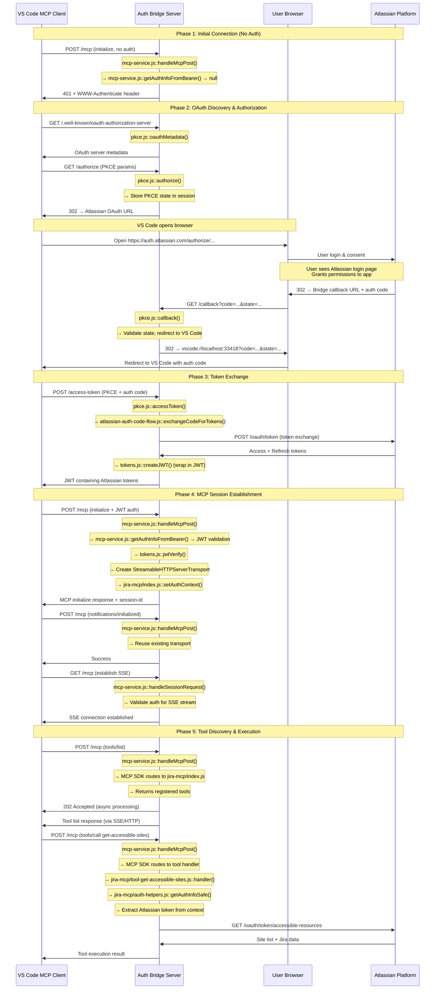

# Connecting to Tool Use - E2E Test Suite

## Overview
This test suite validates the complete end-to-end flow from initial MCP client connection through OAuth authentication to tool execution, ensuring full specification compliance for the main happy path scenario.

## Flow Diagram

## Phase Summaries

### Phase 1: Initial Connection
**What happens**: VS Code MCP client attempts to connect without authentication and gets rejected.

**Trigger**: User first tries to use Jira tools in VS Code

**Specifications**:
- [MCP Specification 2025-06-18](https://modelcontextprotocol.io/docs/specification) - MCP initialize request format
- [RFC 6750 Section 3](https://tools.ietf.org/html/rfc6750#section-3) - WWW-Authenticate Response Header Field
- [RFC 9728 Section 5.1](https://tools.ietf.org/html/rfc9728#section-5.1) - WWW-Authenticate Resource Metadata Parameter

1. *Client* sends MCP initialize request without auth tokens → **`POST /mcp`**
2. **`mcp-service.js::handleMcpPost()`** receives request
3. **`mcp-service.js::getAuthInfoFromBearer()`** → returns null (no auth)
4. **`mcp-service.js::sendMissingAtlassianAccessToken()`** returns 401 with OAuth discovery info

**Outcome**: Authentication required - starts OAuth flow

### Phase 2: OAuth Discovery & Authorization  
**What happens**: VS Code discovers OAuth server details and redirects user to Atlassian for login.

**Trigger**: 401 response from Phase 1

**Specifications**:
- [RFC 8414](https://tools.ietf.org/html/rfc8414) - OAuth 2.0 Authorization Server Metadata
- [RFC 6749 Section 4.1](https://tools.ietf.org/html/rfc6749#section-4.1) - Authorization Code Grant
- [RFC 7636](https://tools.ietf.org/html/rfc7636) - Proof Key for Code Exchange (PKCE)
- [RFC 6749 Section 10.12](https://tools.ietf.org/html/rfc6749#section-10.12) - Cross-Site Request Forgery (State Parameter)

1. *Client* discovers OAuth endpoints → **`GET /.well-known/oauth-authorization-server`**
2. **`pkce.js::oauthMetadata()`** provides OAuth endpoints and capabilities
3. *Client* generates PKCE challenge for secure auth
4. *Client* requests authorization → **`GET /authorize`** (PKCE params)
5. **`pkce.js::authorize()`** handles authorization request
6. **Express session storage** saves PKCE state and MCP client info
7. User browser opens `https://auth.atlassian.com/authorize/...`
8. User grants permissions to the application
9. Atlassian redirects to bridge → **`GET /callback?code=...&state=...`**
10. **`pkce.js::callback()`** receives auth code from Atlassian
11. **`pkce.js::callback()`** validates redirect and sends VS Code callback with auth code

**Outcome**: VS Code has authorization code to exchange for tokens

### Phase 3: Token Exchange
**What happens**: VS Code exchanges the authorization code for access tokens using PKCE verification.

**Trigger**: Authorization code from Phase 2

**Specifications**:
- [RFC 7636 Section 4.3](https://tools.ietf.org/html/rfc7636#section-4.3) - PKCE Code Challenge/Verifier Validation
- [RFC 6749 Section 4.1.3](https://tools.ietf.org/html/rfc6749#section-4.1.3) - Access Token Request
- [RFC 7519](https://tools.ietf.org/html/rfc7519) - JSON Web Token (JWT)
- [Atlassian OAuth 2.0 API](https://developer.atlassian.com/cloud/jira/platform/oauth-2-3lo-apps/) - Token Exchange

1. *Client* requests token exchange → **`POST /access-token`** (PKCE + auth code)
2. **`pkce.js::accessToken()`** handles token exchange request
3. **`pkce.js::accessToken()`** validates code_verifier against stored challenge
4. **`atlassian-auth-code-flow.js::exchangeCodeForTokens()`** calls Atlassian → **`POST https://auth.atlassian.com/oauth/token`**
5. Receives Atlassian access + refresh tokens from OAuth API
6. **`tokens.js::createJWT()`** wraps tokens in bridge-issued JWT

**Outcome**: VS Code has JWT containing Atlassian tokens

### Phase 4: MCP Session Establishment
**What happens**: VS Code establishes authenticated MCP session and transport layer.

**Trigger**: JWT tokens from Phase 3

**Specifications**:
- [MCP HTTP Transport](https://modelcontextprotocol.io/docs/specification/transport) - Session Management and Transport Lifecycle
- [RFC 6750 Section 2.1](https://tools.ietf.org/html/rfc6750#section-2.1) - Bearer Token Usage
- [RFC 7519 Section 7](https://tools.ietf.org/html/rfc7519#section-7) - JWT Validation
- [Server-Sent Events (W3C)](https://html.spec.whatwg.org/multipage/server-sent-events.html) - SSE Protocol

1. *Client* retries MCP initialize with JWT → **`POST /mcp`** (initialize + JWT auth)
2. **`mcp-service.js::handleMcpPost()`** receives initialize with JWT
3. **`mcp-service.js::getAuthInfoFromBearer()`** extracts JWT from Authorization header
4. **`tokens.js::jwtVerify()`** validates JWT and extracts payload
5. **`@modelcontextprotocol/sdk::StreamableHTTPServerTransport`** creation with session ID generator
6. **`jira-mcp/index.js::setAuthContext()`** stores auth info for session
7. *Client* sends notification → **`POST /mcp`** (notifications/initialized)
8. *Client* establishes SSE → **`GET /mcp`** (establish SSE)
9. **`mcp-service.js::handleSessionRequest()`** establishes SSE connection on GET requests

**Outcome**: Authenticated MCP session ready for tool use

### Phase 5: Tool Discovery & Execution
**What happens**: VS Code discovers available tools and executes them with Atlassian APIs.

**Trigger**: Established MCP session from Phase 4

**Specifications**:
- [MCP Tools API](https://modelcontextprotocol.io/docs/specification/tools) - Tool Discovery and Execution
- [JSON-RPC 2.0](https://www.jsonrpc.org/specification) - Remote Procedure Call Protocol
- [JSON Schema Draft 2020-12](https://json-schema.org/draft/2020-12/schema) - Tool Parameter Validation
- [Jira REST API v3](https://developer.atlassian.com/cloud/jira/platform/rest/v3/) - Jira Operations
- [Atlassian OAuth API](https://developer.atlassian.com/cloud/jira/platform/oauth-2-3lo-apps/) - Accessible Resources

1. *Client* requests tool list → **`POST /mcp`** (tools/list)
2. **MCP SDK** routes `tools/list` to registered tool definitions
3. **`jira-mcp/index.js`** returns available Jira tools
4. *Client* calls specific tool → **`POST /mcp`** (tools/call get-accessible-sites)
5. **MCP SDK** routes `tools/call` to specific tool handlers
6. **`jira-mcp/tool-get-accessible-sites.js::handler()`** executes tool
7. **`jira-mcp/auth-helpers.js::getAuthInfoSafe()`** retrieves stored auth
8. **`atlassian-auth-code-flow.js::getAccessibleResources()`** calls Jira → **`GET https://api.atlassian.com/oauth/token/accessible-resources`**
9. Results returned through MCP transport back to client

**Outcome**: Working Jira integration through MCP tools

## Test Files in This Suite

This directory contains test files that validate each phase of the connecting-to-tool-use flow:

- `initial-connection.test.js` - Tests Phase 1 unauthenticated connection and 401 response
- `oauth-discovery.test.js` - Tests Phase 2 OAuth metadata discovery and authorization 
- `authorization.test.js` - Tests Phase 2 PKCE authorization flow and callback handling
- `token-exchange.test.js` - Tests Phase 3 auth code to token exchange with PKCE validation
- `session-establishment.test.js` - Tests Phase 4 MCP session creation and transport setup
- `tool-discovery.test.js` - Tests Phase 5 MCP tool list discovery
- `tool-execution.test.js` - Tests Phase 5 actual tool execution with Jira APIs

Each test file includes a detailed summary explaining what it validates and which specifications it ensures compliance with.

## Key Compliance Areas

This test suite ensures compliance with:

- **OAuth 2.0 Standards**: RFC 6749, RFC 7636 (PKCE), RFC 6750 (Bearer Tokens), RFC 8414 (Server Metadata), RFC 9728 (Resource Metadata)
- **MCP Protocol**: 2025-06-18 specification including HTTP transport, session management, and tools API
- **JSON-RPC 2.0**: Request/response format and error handling
- **JWT Standards**: RFC 7519 token format and validation
- **Atlassian APIs**: OAuth 2.0 integration and Jira REST API usage

## Implementation Reference

For detailed implementation information, see [server/api-flow.md](../../../server/api-flow.md) which documents the complete module responsibilities and integration points.
